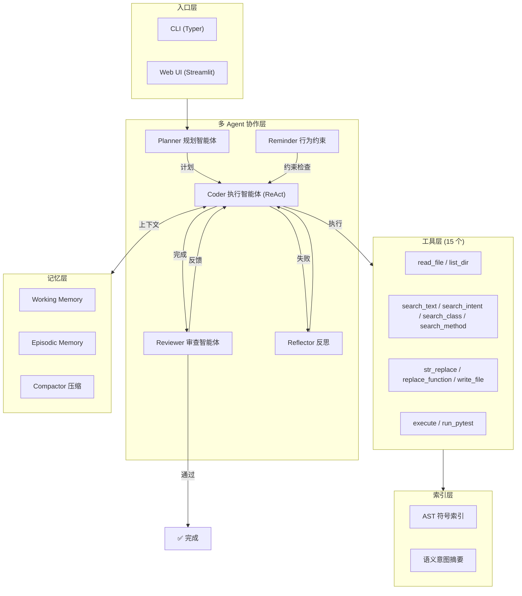

# Code Agent

基于 LLM 的自主代码修复智能体，采用 **Planner → Coder → Reviewer** 多 Agent 协作架构，能够接收自然语言任务描述，自动理解代码库、规划修复步骤、编辑代码、审查质量、运行测试验证，实现端到端的 bug 修复闭环。

## 核心特性

- **多 Agent 协作**：Planner 规划 → Coder 执行 → Reviewer 审查，三阶段闭环
- **15 个工具**：read / search / edit / execute 四类核心能力，含 AST 级别编辑
- **符号-语义双层索引**：AST 符号索引 + 文件意图摘要，秒级精确定位
- **反思自修复**：失败时自动分析错误、生成修复策略、重试（最多 3 次）
- **行为约束检查**：检测过早提交、上下文收集不足、死循环等异常模式
- **上下文压缩**：防止长会话爆炸，自动压缩旧消息为摘要
- **91 个单元测试**：覆盖 6 个核心模块，全部通过
- **消融实验框架**：支持 6 组配置对比，量化每个模块贡献
- **Streamlit Web UI**：实时展示规划、工具调用、审查进度

## 架构图



## 快速开始

### 1. 环境准备

```bash
conda create -n code-agent python=3.11 -y
conda activate code-agent
pip install -r requirements.txt
```

### 2. 配置 API Key

```bash
cp .env.example .env
# 编辑 .env，填入你的 API Key
```

`.env` 内容：
```
DEEPSEEK_API_KEY=你的key
DEEPSEEK_BASE_URL=https://api.deepseek.com
```

### 3. CLI 运行

```bash
set PYTHONPATH=src          # Windows
export PYTHONPATH=src       # Linux/Mac

python -m code_agent.cli "修复 examples/m6_real_bugs/string_utils.py 的 bug，让测试通过"

# 消融实验：关闭某个模块
python -m code_agent.cli "修复 bug" --no-planner
python -m code_agent.cli "修复 bug" --no-reviewer
```

### 4. Web UI 运行

```bash
streamlit run src/code_agent/ui/streamlit_app.py
```

浏览器打开 `http://localhost:8501`，左侧选择示例任务，点击"开始执行"。

### 5. 批量评测

```bash
# 跑单组配置
python scripts/run_eval.py

# Agent vs 基线对比
python scripts/run_eval.py --baseline

# 完整消融实验（6 组配置）
python scripts/run_eval.py --ablation
```

## 项目结构

```
code-agent/
├── src/code_agent/
│   ├── cli.py                  # 命令行入口
│   ├── actor.py                # ReAct 主循环 + 多 Agent 协调（核心）
│   ├── config.py               # 配置中心（20+ 参数，环境变量覆盖）
│   ├── agent/
│   │   ├── planner.py          # 规划智能体：任务拆解为步骤
│   │   ├── reflector.py        # 反思智能体：分析失败原因
│   │   ├── reviewer.py         # 审查智能体：代码质量审查（只读权限）
│   │   └── reminder.py         # 行为约束：死循环/过早提交检测
│   ├── tools/
│   │   ├── registry.py         # 工具注册表 + dispatch
│   │   ├── read.py             # 文件读取（100 行窗口）
│   │   ├── edit.py             # str_replace + AST 级别编辑
│   │   ├── search.py           # ripgrep + 检索反思
│   │   └── execute.py          # shell 执行 + 安全拦截
│   ├── indexer/
│   │   └── ast_index.py        # AST 符号索引 + 语义意图摘要
│   ├── memory/
│   │   ├── working.py          # 短期记忆（最近 6 轮）
│   │   ├── episodic.py         # 长期记忆（摘要压缩）
│   │   └── compactor.py        # 上下文压缩调度
│   ├── utils/
│   │   ├── retry.py            # LLM 调用重试（指数退避）
│   │   └── logging.py          # 结构化日志
│   └── ui/
│       └── streamlit_app.py    # Web UI
├── tests/                      # 91 个单元测试
├── evaluation/
│   ├── tasks/                  # 15 个评测任务
│   └── results/                # 评测报告输出
├── scripts/
│   ├── run_eval.py             # 批量评测 + 消融实验
│   └── run_swebench.py         # SWE-bench Lite 评测
├── requirements.txt
├── pyproject.toml
└── .env.example
```

## 技术选型

| 组件 | 选择 | 理由 |
|---|---|---|
| LLM | DeepSeek-V3 | 工具调用稳定，价格极低（≈¥1/M tokens） |
| Agent 框架 | 自研轻量循环 | 13 个开源 Agent 源码分析后的最优选择 |
| 多 Agent | Planner + Coder + Reviewer | 分工明确，Reviewer 只读权限保证安全 |
| 编辑格式 | str_replace + AST 替换 | 文本匹配 + 函数级定位双保险 |
| AST 解析 | Python 内置 `ast` | 仅 Python 项目，零依赖 |
| 搜索 | ripgrep + 降级 Python | rg 比 grep 快 5-10x |
| UI | Streamlit | 一文件即可跑，最适合演示 |

## 论文基础

本项目的设计决策基于 12 篇 2024-2026 年代码智能体前沿论文：

- **OPENDEV** (2026)：脚手架/运行时分离、5 阶段压缩、事件驱动提醒
- **SWE-agent** (NeurIPS 2024)：ACI 4 原则、100 行文件窗口、lint guardrail
- **AutoCodeRover** (ISSTA 2024)：7 个 AST search API
- **CodeStruct** (AWS, 2026)：结构化动作空间、AST 级别编辑
- **Behavioral Drivers** (2026)：过早提交/上下文不足检测
- **Agentic RAG with Reflections** (2026)：检索阶段反思
- **Symbolic-Semantic Indexing** (2026)：符号+语义双层索引

## 评测体系

### 消融实验数据

在 15 个评测任务（10 基础 + 2 中等 + 3 高难度）上的消融实验结果：

| 配置 | 通过率 | 描述 |
|---|---|---|
| **agent_full** | **93%** | 完整版（Plan + Reflect + Remind + Review） |
| baseline | 87% | 裸 LLM，无任何模块 |
| no_planner | 80% | 去掉规划模块 |
| no_reflector | 87% | 去掉反思模块 |
| no_reminder | 73% | 去掉行为约束检查 |
| no_reviewer | 67% | 去掉代码审查模块 |

### 模块贡献度

```
完整版 93% — 各模块关闭后通过率下降：

Reviewer  93% → 67%  ↓26%  ← 审查是最大的贡献者
Reminder  93% → 73%  ↓20%  ← 防止过早完成、死循环
Planner   93% → 80%  ↓13%  ← 多文件任务需要规划
Reflector 93% → 87%  ↓6%   ← 失败后反思重试
```

**结论**：Reviewer（代码审查）和 Reminder（行为约束）是贡献最大的模块。高难度任务（多文件交互）最能体现模块价值，简单任务裸 LLM 也能搞定。

### 评测任务

- **task_01 ~ task_10**：单文件 Python bug 修复（基础难度）
- **task_11 ~ task_12**：多文件交互 bug（中等难度）
- **task_13 ~ task_15**：需要跨文件推理 + 测试驱动的复杂 bug（高难度）

## 还能改进什么

| 改进项 | 投入 | 面试价值 |
|---|---|---|
| Docker 沙箱执行 | 1 天 | 展示安全意识 |
| 异步并发评测 | 1 天 | 生产级能力 |
| Token 精确计数（替代消息条数） | 半天 | 成本优化 |
| Agent 决策 trace 可视化 | 半天 | 演示效果好 |
| 支持更多 LLM 提供商（Claude/GPT） | 半天 | 灵活性 |

## License

MIT
